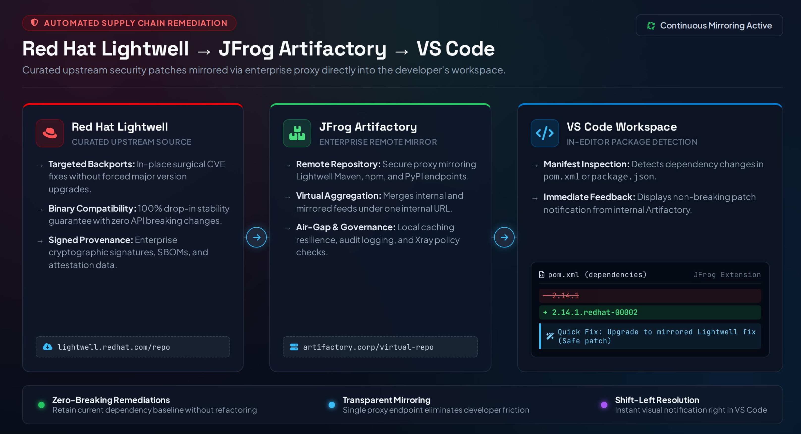

# Lightwell Developer Demo

## Overview
This demo illustrates the end-to-end integration flow from the **Red Hat Lightwell Repository** to **JFrog Artifactory**, and ultimately to the **Java Developer** using Maven for builds. 

The primary goal is to demonstrate what happens when an underlying application package changes—showing both the impact on downstream builds and how this workflow empowers developers with seamless dependency updates.

## Architecture Slide



---

## Getting Started

### Prerequisites
Before running this demo, ensure you have the following installed and configured on your local machine:

* **Java Development Kit (JDK):** Version 11 or higher
* **Apache Maven:** Version 3.8+ configured for local builds
* **Podman Desktop:** Downloaded, installed, and running locally
* **Red Hat Lightwell Repository Access:** Active account credentials/tokens configured to pull from the Red Hat Lightwell Registry
* **JFrog Artifactory Access:** Server URL and authentication token for artifact resolution

---

## Environment Setup

## 1. Setting up JFrog (Mac)

On your own download releases-docker.jfrog.io/jfrog/artifactory-oss:7.77.10
Run the following commands to create the environment directory:

```bash
rm -rf $HOME/jfrog
mkdir -p $HOME/jfrog
cd $HOME/jfrog
```

## 2. Start JFrog Artifactory
Spin up the service container using Podman Compose:

```bash
podman compose up -d
podman logs -f artifactory
podman logs artifactory | grep -i "successfully started"
```

> **Note:** Access the web interface at **http://localhost:8082** (main JFrog Gateway) rather than port 8081.

## 3. Connect Lightwell to Artifactory
> 🎬 **Note:** Due to file size limits, the video walkthrough cannot be played inline. 
> Please [download and watch the screen recording here](./artifactorysetup.mp4).  

## 4. Configure Maven Integration to Maven Central and your local Artifactory

1. Move the `settings.xml.example` file into your local Maven directory (`~/.m2/settings.xml`) and make the necessary changes:

```bash
mkdir -p ~/.m2
cp settings.xml ~/.m2/settings.xml
```

*Be sure to update `settings.xml` with your personal encrypted password or token.*

## 5. Run the Application

First take the my-app.tar.gz and uncompress and then bringup in vscode.
```bash
tar -xzf my-app.tar.gz
```

In the vscode marketplace install the Red Hat Dependency Analytics (RHDA)
Make sure you see the following in your pom.xml file:
```
       <dependency>
            <groupId>org.slf4j</groupId>
            <artifactId>slf4j-ext</artifactId>
            <version>1.7.25</version>
        </dependency>
```
This exposes the following CVE:
slf4j-ext:1.7.25 (and the SLF4J Extensions module in general) is primarily known in security contexts for a critical Java deserialization vulnerability tracked under CVE-2018-8088.Key DetailsVulnerability (CVE-2018-8088): An XML deserialization flaw exists within the EventData class constructor in slf4j-ext.   Impact: If an application passes an untrusted XML serialized string into EventData, it can be deserialized using XMLDecoder, allowing remote attackers to execute arbitrary code (RCE) on the host machine.Artifact Function: Formally, the module is the SLF4J Extensions Module (org.slf4j:slf4j-ext), which adds supplementary features to the standard SLF4J logging facade, such as localized logging, extended logging interfaces (XLogger), and event logging.

Now, you will see the 1.7.25 with the red squiggly line.  You can right click on your pom.xml and look at the dependency report, generate an sbom. You can also click on 1.7.25 which will create a lamp that you can click to fix the error.  In my case, my lightwell validated version is 2.0.9 so that is what gets placed in the pom.xml file.

You have corrected the issue and can now build and execute the Java application from within vscode.:

```bash
mvn clean package
mvn exec:java -Dexec.mainClass="com.example.App"
```


[def]: ./docs/LightwelltoArtifactorytoVSCode.pdf
